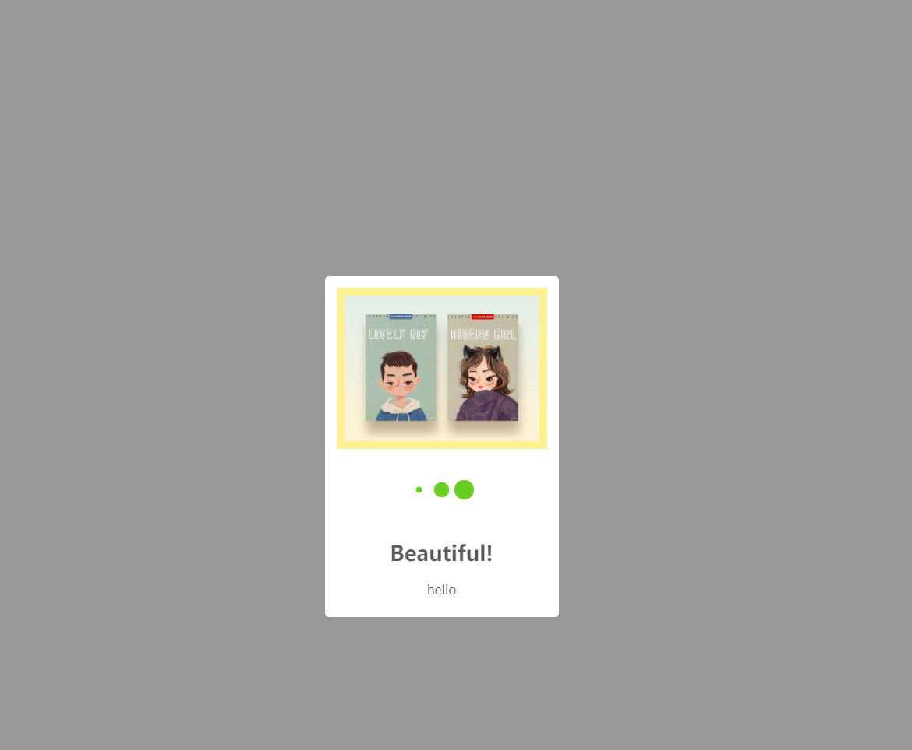
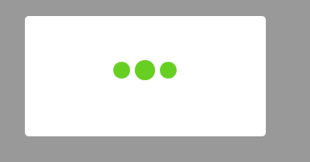

# simple-toast
a simple toast lib

# how to use
````
<script type="text/javascript" src="simple-toast.js"></script>
````
and you can use like this
````
st({
      text:"hello",
      icon:"loading",
      title:"Beautiful!",
      imgUrl:"http://images.shejidaren.com/wp-content/uploads/2019/07/20190731-18.jpg"
  })
// and use ts.hide(during) to hide the toast
st.hide(1500)
````
##### it will like this


### configuration
- #### text 
    #####(Type: string,Default:"")
    ##### Description:the toast's text    
    ##### Examples
    ````
    st({text:"hello"})
    ````
    

- #### title 
    ##### Type: string,Default:""   
    ##### Description:the toast's title    
    ##### Examples 
    ````
    st({title:"Beautiful!"})
    ````
    

- #### icon
    ##### Type: string  
    ##### Description:the toast's icon,now it's just have one icon 'loading'    
    ##### Examples
    ````
    st({icon:"loading"})
    ````
    

- #### imgUrl
    ##### Type: string  
    ##### Description:the toast's can append a img   
    ##### Examples
    ````
    st({imgUrl:"http://images.shejidaren.com/wp-content/uploads/2019/07/20190731-18.jpg"})
    ````
    

### Methods
- #### hide
    ##### params: (during: number)  
    ##### Description:close the toast,and the during is ms
  ````
  st.hide(during)
  ````
    